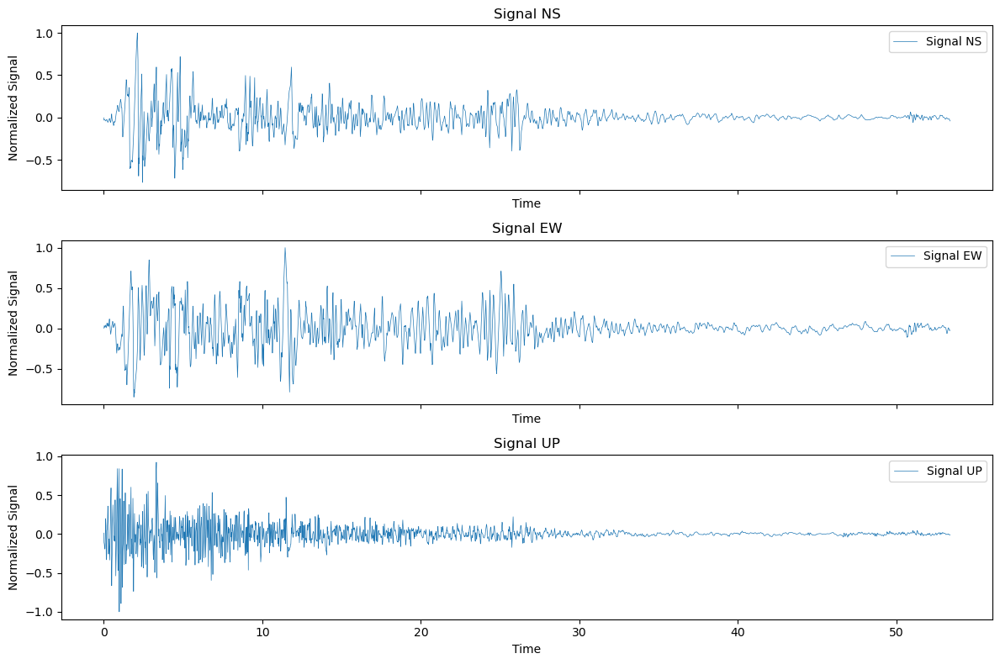
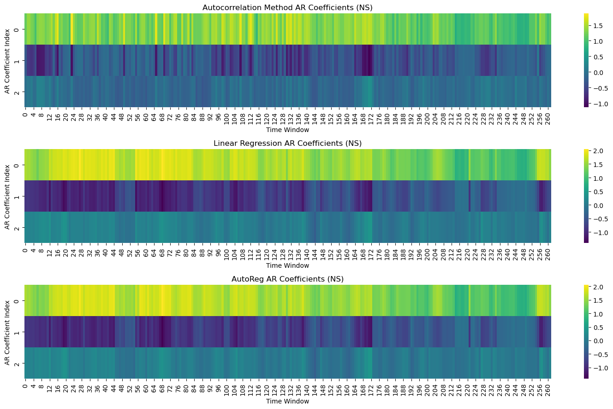
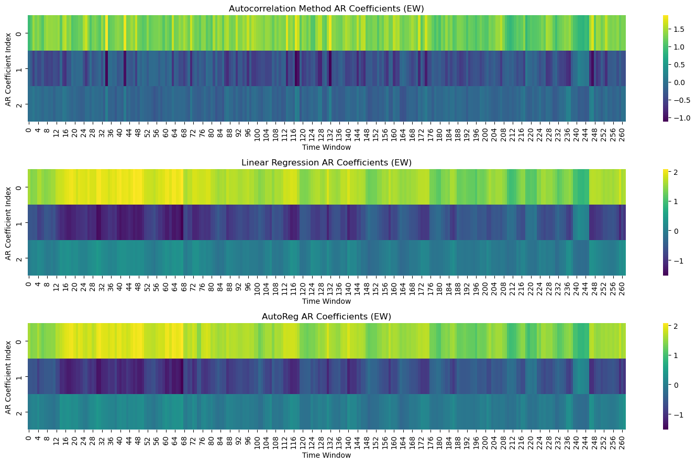
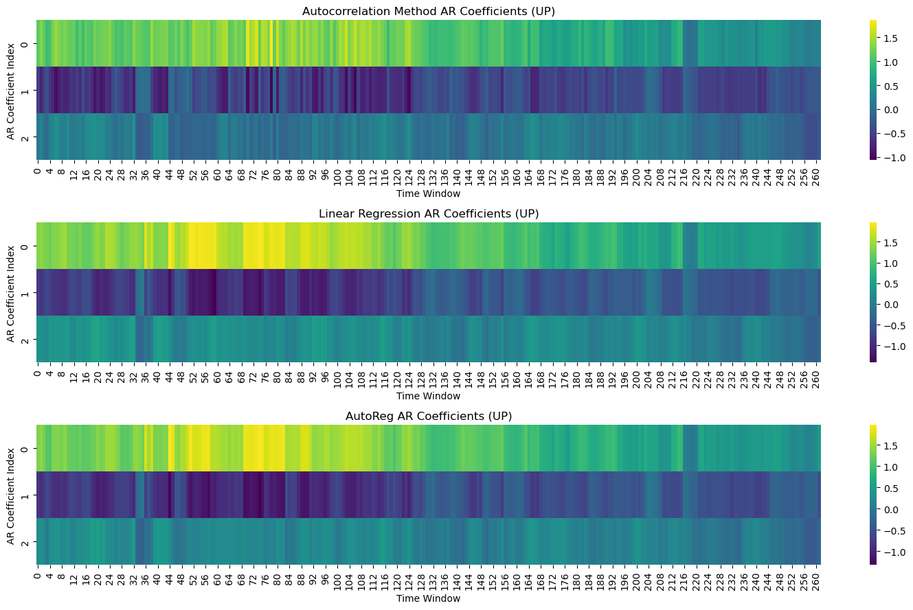

# Seismic Signal Analysis with AR Coefficients

This project analyzes seismic signals in three directions (NS, EW, and UP) using Autoregressive (AR) coefficients. The signals are processed to identify key seismic events such as primary seismic waves, secondary waves, and aftershocks.

## Dataset

The dataset used in this project is sourced from the [El Centro Seismic Station](https://www.vibrationdata.com/elcentro.htm), containing seismic signal data in the North-South (NS), East-West (EW), and Upward (UP) components.

## Project Structure

1. **Solving for 3rd order AR coefficinets**: Implementation of Yule-Walker method of solving autocorrelation matrix for AR coefficients, Linear fitting and AutoReg function from Statsmodel library.
2. **Seismic Signal Plots**: Visualization of the seismic signals over time for each component (NS, EW, and UP).
3. **AR Coefficients Cluster Maps**: Cluster maps representing the AR coefficients (\(\phi_1\), \(\phi_2\), \(\phi_3\)) across time windows to understand seismic activity.

## Requirements

- Python 3.x
- Libraries: `numpy`, `matplotlib`, `scipy`, `pandas`

